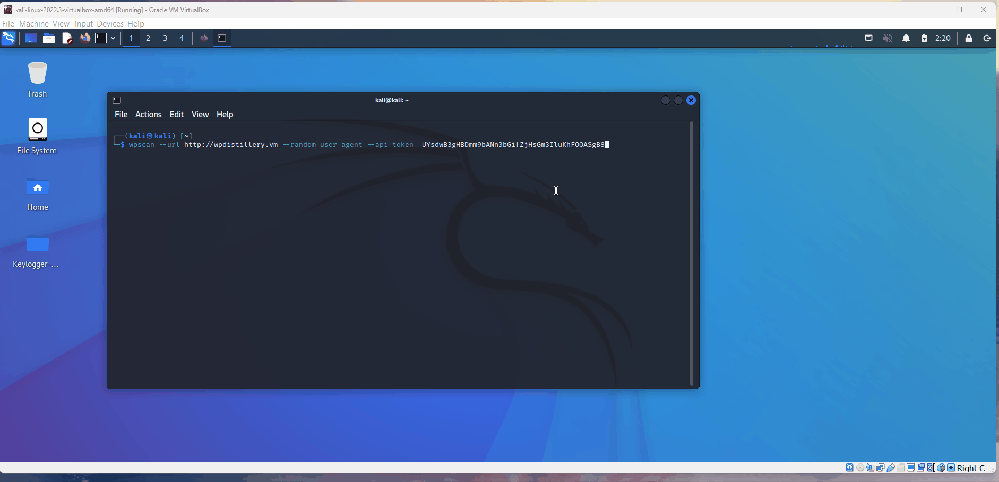

# Project 7 - WordPress Pen Testing

Time spent: 4 days spent in total

> Objective: Find, analyze, recreate, and document **Three vulnerabilities** affecting an old version of WordPress

## Pen Testing Report
### Scan
This is a scan done with WordPress version 4.0 and the reflex-gallery plugin. Using WPScan with a Kali linux OS in Virtual Box the scan shows 112 Vulnerabilities. 



### 1. Admin XSS

- [ ] Summary: 
  - Vulnerability types: Cross-Site Scripting (XSS)
  - Tested in version: Word Press 4.0
  - Fixed in version: 4.6.1
- [ ] GIF Walkthrough:

- [ ] Steps to recreate:
Here the admin will be logged in creating a page for the end-users. While the admin creates this page they can hide a XSS script such as this one ```<a href="></a><a title=" onClick=alert('Well_hello_there') "> Nature</a>```

- [ ] Affected source code:
  - [Link 1](https://core.trac.wordpress.org/browser/tags/version/src/source_file.php)
  
### 2. (Required) Vulnerability Name or ID

- [ ] Summary: 
  - Vulnerability types: Click Jacking
  - Tested in version:
  - Fixed in version: 
- [ ] GIF Walkthrough:

- [ ] Steps to recreate: 
- [ ] Affected source code:
  - [Link 1](https://core.trac.wordpress.org/browser/tags/version/src/source_file.php)

### 3. (Required) Vulnerability Name or ID

- [ ] Summary: 
  - Vulnerability types:
  - Tested in version:
  - Fixed in version: 
- [ ] GIF Walkthrough:

- [ ] Steps to recreate: 
- [ ] Affected source code:
  - [Link 1](https://core.trac.wordpress.org/browser/tags/version/src/source_file.php)

## Assets

List any additional assets, such as scripts or files

## Resources

- [WordPress Source Browser](https://core.trac.wordpress.org/browser/)
- [WordPress Developer Reference](https://developer.wordpress.org/reference/)
- [PortSwigger XSS Cheat Sheet](https://portswigger.net/web-security/cross-site-scripting/cheat-sheet)

GIFs created with  ...
[ScreenToGif](https://www.screentogif.com/) for Windows

## Notes
Challenges that I encountered was understanding the instructions since they were not as clear until a TA had explained them to me.
