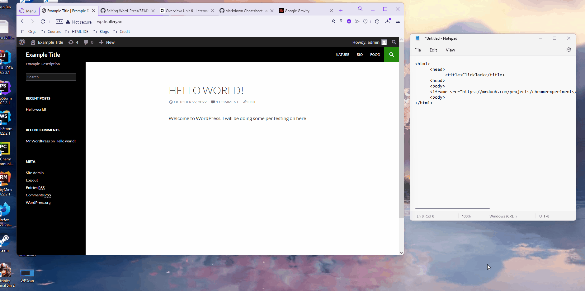

# Project 7 - WordPress Pen Testing

Time spent: 4 days spent in total

> Objective: Find, analyze, recreate, and document **Three vulnerabilities** affecting an old version of WordPress

## Pen Testing Report
### Scan
This is a scan done with WordPress version 4.0 and the reflex-gallery plugin. Using WPScan with a Kali linux OS in Virtual Box the scan shows 112 Vulnerabilities. 


### 1. Admin XSS

- [ ] Summary: 
  - Vulnerability types: Cross-Site Scripting (XSS)
  - Tested in version: Word Press 4.0
  - Fixed in version: 4.6.1
- [ ] GIF Walkthrough:

- [ ] Steps to recreate:
Here the admin will be logged in creating a page for the end-users. While the admin creates this page they can hide a XSS script such as the one below for them to click. That can then execute the injections and cause future harm.

```
<a href="></a><a title=" onClick=alert('Well_hello_there') "> Nature</a>
```

- [ ] Affected source code:
  - [Link 1]([[https://core.trac.wordpress.org/browser/tags/version/src/source_file.php](http://wpdistillery.vm/%3E%3C/a%3E%3Ca%20title=)]

### 2. (Required) Vulnerability Name or ID

- [ ] Summary: 
  - Vulnerability types: Click Jacking
  - Tested in version: 4.0
  - Fixed in version: Im not sure
- [ ] GIF Walkthrough:



- [ ] Steps to recreate: 

Clickjacking can be used to redirect the end-user somewhere else using a link or image. This attack is also considered part of the XSS family but it is also known as "hijack clicking". In the first attack it imitate a link that the end-user will click on. From there the threatactor will be able to looking into thier cookie sessions and steal any assets the user may have. The second attack shows an image that has a hidden link. If the image was suppose to imitate a video the target will click on it initating what ever attack may happen. In this case it the target was redirected to a new webpage. 

```
<html>
	<head>
		<title>ClickJack</title>
	<head>
	<body>
	<iframe src="https://mrdoob.com/projects/chromeexperiments/google-gravity/" onmouseover= alert(document.cookie);></iframe>
	<body>
```

```
<a href="https://mrdoob.com/projects/chromeexperiments/google-gravity/" rel="nofollow"></a>
```

- [ ] Affected source code:
[Link 1](http://wpdistillery.vm/bio/)

### 3. Arbitrary File Upload

- [ ] Summary: 
  - Vulnerability types: XSS
  - Tested in version:4.0
  - Fixed in version: 
- [ ] GIF Walkthrough:


- [ ] Steps to recreate: 
This exploit was already discovered back in `2015-03-08` by `Anant Shrivastava`. However I though this was good to point out again because this exploit did show up on my WPScan from the relfex-gallery plugin, verion 1.3.3, and I will be recreating the attack. What makes this exploit harmful is from the plugin itself. The reason is this plugin and I'm sure others opens up a hole allowing the threatactor to inject a XSS code. Once injected the threatactor is able to upload any type of file to the webpage causing unknown harm; all because the application fails to sanitize the input.

``` 
<form method = "POST" action = "" enctype = "multipart/form-data" >
<input type = "file" name = "qqfile"><br>
<input type = "submit" name = "Submit" value = "inurl">
</form >

```

- [ ] Affected source code:
  - [Link 1](http://wpdistillery.vm/food/#comment-11)


## Resources

- [WordPress Source Browser](https://core.trac.wordpress.org/browser/)
- [WordPress Developer Reference](https://developer.wordpress.org/reference/)
- [PortSwigger XSS Cheat Sheet](https://portswigger.net/web-security/cross-site-scripting/cheat-sheet)
- [A story of forgotten disclosure and DOM XSS](https://blog.anantshri.info/forgotten_disclosure_dom_xss_prettyphoto)

GIFs created with  ...
[ScreenToGif](https://www.screentogif.com/) for Windows

## Notes
Challenges that I encountered was understanding the instructions since they were not as clear until a TA had explained them to me.

## License

    Copyright [yyyy] [Francisco Frade]

    Licensed under the Apache License, Version 2.0 (the "License");
    you may not use this file except in compliance with the License.
    You may obtain a copy of the License at

        http://www.apache.org/licenses/LICENSE-2.0

    Unless required by applicable law or agreed to in writing, software
    distributed under the License is distributed on an "AS IS" BASIS,
    WITHOUT WARRANTIES OR CONDITIONS OF ANY KIND, either express or implied.
    See the License for the specific language governing permissions and
    limitations under the License.
